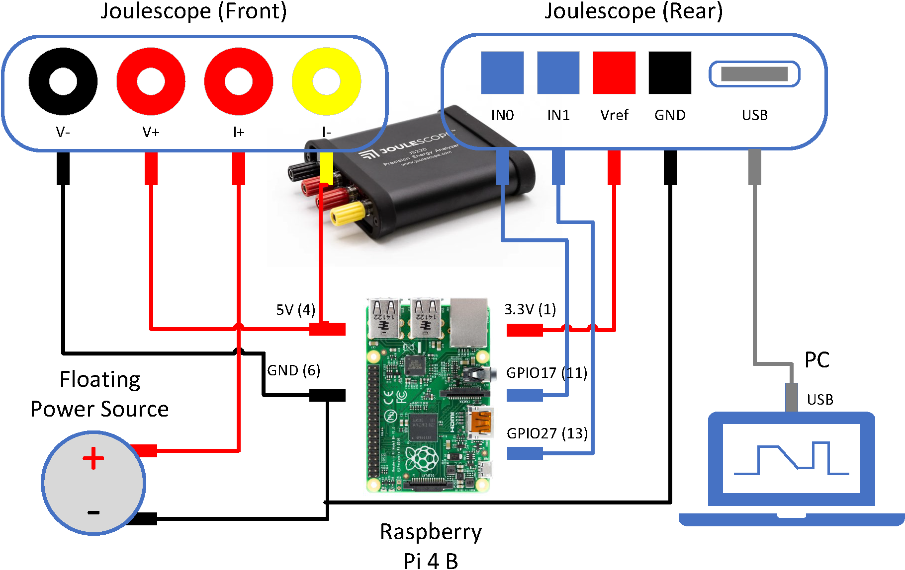

# coro_edge_energy


## Introduction
This public repo contains the source code for the paper "Reducing Energy Consumption for Machine Learning Inference on Edge Devices using C++20 Coroutines" by Anon. The paper is currently under review for the [Elsevier Internet of Things journal](https://www.journals.elsevier.com/internet-of-things). 

Paper abstract:

> Increasingly, machine learning inference is implemented on relatively low-powered edge devices, where battery life is a key performance criterion. In this work, we demonstrate how C++20 coroutines can be used to reorganise the execution order of an iterative inference task on an edge device. A Prognostic and Health Management (PHM) application receives streams of vibration data as envelope spectra from a wireless sensor network and processes them locally through an array of Support Vector Machines. In our experiments on ARM Cortex A72 \& A53 64-bit SoCs, this method can reduce energy consumption for the task by up to 18\%, reduce overall energy use by up to 20\% and cut execution time by up to 20.5\%. Furthermore, peak power levels are reduced by up to 4.5\%, and peak current is reduced by up to 25 mA: this can increase the total battery life of rechargeable batteries. We demonstrate that the necessary changes to the C++ code are simple, repeatable and generally applicable to iterative inference tasks.

## Repository structure
The repository is structured as follows:

```
-- cppsource
   |-- CMakeLists.txt (CMake file)
   |-- infer7.cpp (Main source file)
   |-- include
       |-- perf
   |-- perf (Performance measurement code)
   |-- scripts
       |-- run_infer_l_sync.sh (Script to run experiment on Pi)
   |-- test (Test code)
-- docs
-- notebooks (Jupyter-notebook source)
-- python (Python source)
   |-- .vscode
```

The C++ source builds and runs on the target platforms (Raspberry Pi 4 B & Raspberry Pi 3 B+) and on Windows 11 WSL2 Ubuntu. The Python source runs on Windows 11 and the Jupyter notebooks run on Windows 11 with Python 3.9+.

## Libraries

1.  Google Test  
Imported from [GitHub](https://github.com/google/googletest/archive/03597a01ee50ed33e9dfd640b249b4be3799d395.zip) using FetchContent. 
1.  FPM  
Header-only fixed-point math library from [GitHub](https://github.com/MikeLankamp/fpm). 
1.  TCLAP  
Header-only command-line processing library from [GitHub](https://github.com/mirror/tclap). Note that this build requires branch `1.4`.
1.  TLX  
Header-only template library from [GitHub](https://github.com/tlx/tlx).
1.  WiringPi  
See [Setting up the Raspberry Pi](docs/raspberrypi.md).

## Computer Setup

- [Setting up the Raspberry Pi](docs/raspberrypi.md)  
- [Setting up Windows WSL2 Ubuntu](docs/windows_swl2_ubuntu.md)  
- [Setting up Windows 11 & Python](python/readme.md)

## Hardware setup

The hardware setup for the experiment is discussed in the paper in **Section 3.6 Performance measurement**, and is shown in the following figure:



Power is supplied to the Raspberry Pi test platform from a benchtop floating power supply (GW Instek GPW_3323) via the [Joulescope 220](https://www.joulescope.com/products/js220-joulescope-precision-energy-analyzer), following the wiring advice in the [Joulescope User Manual](https://download.joulescope.com/products/JS220/JS220-K000/users_guide/Joulescope%20JS220%20User's%20Guide%20v1_5.pdf) section 9.3. The Joulescope is connected to a Windows 11 PC via USB 3.0. The Joulescope software is used to record the power consumption of the Raspberry Pi during the experiment.

The Joulescope also receives digital signals from the Raspberry Pi via the GPIO pins. The Joulescope software is used to record the digital signals from the Raspberry Pi during the experiment, in synchrony with the power consumption data.


